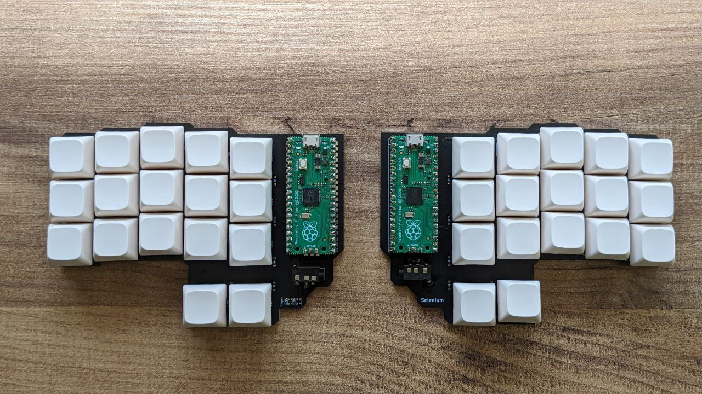

# MKPico, a Pi pico USB Keyboard framework

Welcome to **MKPico**, a framework designed for creating custom keyboard firmware using the Raspberry Pi Pico microcontroller. MKPico is built using **FreeRTOS**, **Pico SDK** and **tinyUSB**.


<center>Selenium s (34 keys split mechanical keyboard)</center>

## Overview

This repository is the home of MKPico, and it includes everything you need to get started with developing your own keyboard firmware. MKPico abstracts the complexities of USB communication and real-time task management, providing an easy-to-use framework that is both powerful and efficient.

The first project built using MKPico is Selenium S, a custom 34-key split keyboard that demonstrates the capabilities of the framework. Selenium S serves as a reference implementation and a starting point for your own projects.

The main goals of the project are:

- **Cross-Platform Compatibility**: MKPico ensures that your keyboards work seamlessly across multiple operating systems, including Linux and Windows.
- **Support for Boot and Normal Modes**: The framework fully supports USB boot mode, making your keyboard operational even during system boot (BIOS/UEFI) and in the normal operating system environment.
Real-Time Operating System: Powered by FreeRTOS, MKPico offers real-time task management, allowing for precise control over keyboard functions and responsiveness.
- **USB Protocol Management**: Built on TinyUSB, MKPico handles USB communication reliably, ensuring your keyboard is fully compliant with USB standards.
- **Modular Design**: MKPico’s modular architecture allows you to extend or customize the framework to suit specific needs, whether it’s adding new HID features or integrating with other hardware components.
- **Easy porting to new keyboard designs**: The repository should allow to create new keyboard designs easily by defining a new layout and some key characteristics.


## Project Structure

The MKPico project is organized into several key directories, each serving a specific purpose in the development and configuration of custom keyboards. Below is an overview of the project structure:

- **`config/`**:
  - This folder contains configuration files for specific keyboards. Each keyboard has its own configuration file, which defines settings such as the key layout, pin mappings, and any special features or behaviors unique to that keyboard. By modifying these files, you can easily adapt MKPico to support different keyboard designs.

- **`include/`**:
  - The `include` directory houses the internal API headers that define the interfaces and data structures used throughout the MKPico framework. These headers are essential for maintaining a clear and consistent API across different modules of the project, making it easier to develop and extend functionality.

- **`src/`**:
  - This folder contains the core logic of the MKPico framework. It includes the following components:
    - **Internal I2C Communication**: Manages communication between the split halves of the keyboard, ensuring synchronized key presses and other functions across the two parts.
    - **USB Interface**: Handles the USB communication with the host computer, including enumeration, report generation, and processing of USB HID events.
    - **Logic of Layers and Key Map**: Implements the functionality for keyboard layers and key mapping, allowing users to define multiple layouts and switch between them dynamically.
    - **Keystrokes Handling**: Processes key presses and releases, manages debouncing, and ensures accurate and responsive input detection.

  
## Getting started

This section guides you through setting up the environment to work with FreeRTOS and the Raspberry Pi Pico SDK.

### 1. Clone FreeRTOS Repository

First, clone the FreeRTOS kernel repository:

```bash
git clone https://github.com/FreeRTOS/FreeRTOS-Kernel.git
cd FreeRTOS-Kernel
```

And move to the smp branch that supports multiple core:

```bash
git checkout -t remotes/origin/smp
git submodule update --init
```

### 2. Clone Pico SDK Repository

Second, clone the Pico SDK repository:

```bash
git clone https://github.com/raspberrypi/pico-sdk.git
cd pico-sdk
git submodule update --init
```

### 3. Set environment variables 

Set environment variables to point to the FreeRTOS and Pico SDK directories:

```bash
export FREERTOS_KERNEL_PATH=/path/to/FreeRTOS-Kernel
export PICO_SDK_PATH=/path/to/pico-sdk
```

### 4. Initialize project code

Now, clone your project repository and initialize it.

```bash
cd /path/to/your/workspace
git clone https://github.com/tknbr/mkpico.git
cd mkpico
git submodule update --init
```

### 5. Set up CMake and Build the Project

You can now set up CMake and build the project:

```bash
mkdir build
cd build
cmake ..
make
```

## Acknowledgements

The development of MKPico and the Selenium S keyboard was greatly influenced and supported by the vibrant communities dedicated to mechanical keyboards and custom firmware development. We would like to extend our gratitude to the following communities and content creators for their invaluable resources, tutorials, and inspiration:

- **Mechanical Keyboard Enthusiasts on GitHub**: The numerous open-source keyboard projects and libraries available on GitHub have been instrumental in shaping the direction of MKPico. Special thanks to repositories like [QMK Firmware](https://github.com/qmk/qmk_firmware), which provided insight into advanced keyboard features and firmware structure.
  
- **YouTube Content Creators**: Channels such as [Joe Scotto](https://www.youtube.com/@joe_scotto) and [Ben Vallack](https://www.youtube.com/c/BenVallack) have offered detailed build guides, reviews, and deep dives into keyboard design that have been incredibly helpful during the development process.

- **Online Keyboard Communities**: Platforms like [r/ErgoMechKeyboards](https://www.reddit.com/r/ErgoMechKeyboards/) on Reddit, and forums like [Geekhack](https://geekhack.org/), have provided a wealth of information and community support that was crucial in overcoming challenges during the project.

This project would not have been possible without the contributions of these communities, and we encourage anyone interested in custom keyboard development to explore these resources and get involved.


